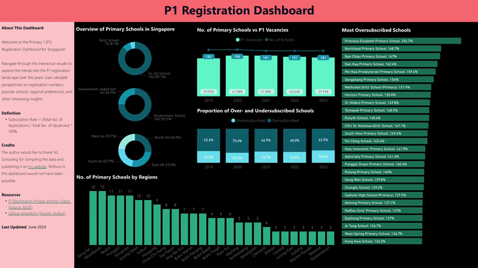
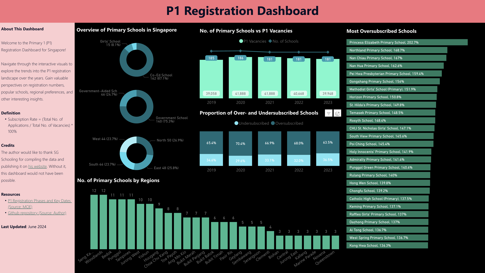
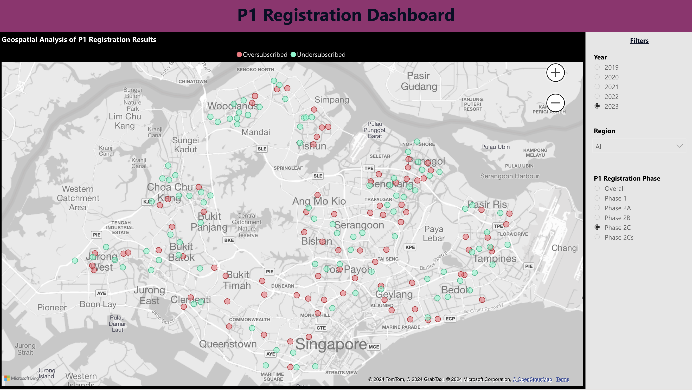
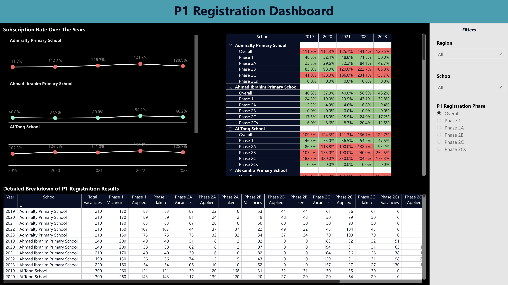
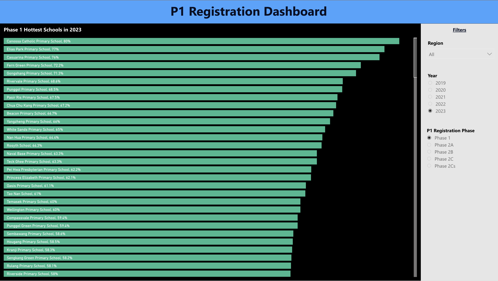
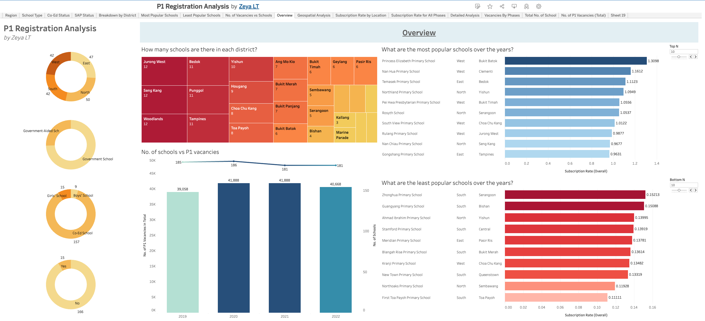
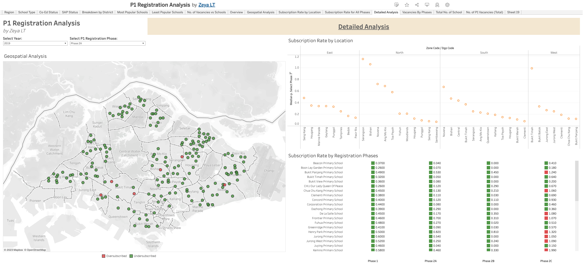

# P1 Registration Dashboard

This is a self-initiated project to visualise Primary 1 registration data in a Tableau Public dashboard. 

## This Repo

This repo contains the Python code to (1) scrap data from https://sgschooling.com/; and (2) cleaning the data in multiple ways. 

## Dashboards

### Power BI (Recent)

[Link](https://app.powerbi.com/view?r=eyJrIjoiMzA3Njk5MjYtMmRmOS00NjlkLWE5NWItYzE1MjkyZTUzNjVmIiwidCI6IjBmYjkwN2NiLTQwNDgtNDA0My05YTMyLTk2NTc2Nzg0MWYyMyIsImMiOjEwfQ%3D%3D) to dashboard.

### Tableau Public 

[Link](https://public.tableau.com/app/profile/zeya.lt/viz/P1RegistrationAnalysis/Overview#1) to dashboard.

